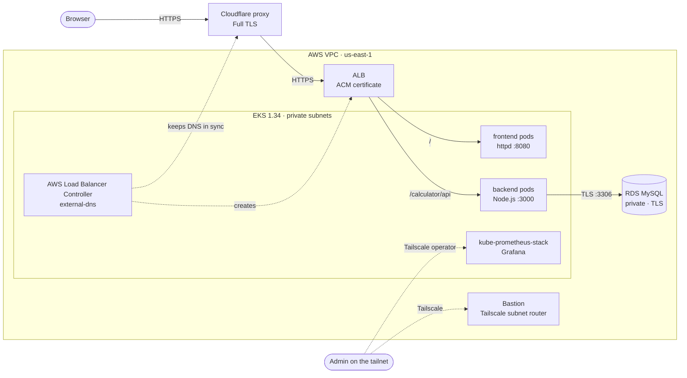
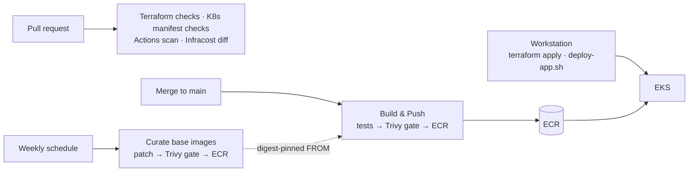

# Calc App on AWS EKS

[](https://github.com/xXSAPXx/aws-eks-platform/actions/workflows/terraform-checks.yml)
[](https://github.com/xXSAPXx/aws-eks-platform/actions/workflows/k8s-checks.yml)
[](https://github.com/xXSAPXx/aws-eks-platform/actions/workflows/actions-scan.yml)
[](https://github.com/xXSAPXx/aws-eks-platform/actions/workflows/build-push-images.yml)

A three-tier calculator app (static frontend, Node.js API, MySQL) running on
**AWS EKS** behind **Cloudflare** and an **ALB**, with all infrastructure in
**Terraform**.

The app is deliberately simple. The point is the platform around it:
supply-chain-hardened CI, curated base images, hardened pods, measured
zero-downtime rollouts, cost visibility, and changes migrated live on a
running stack.

> The stack is ephemeral: it's brought up for a working session and destroyed
> afterwards to keep cost down, so `https://www.xxsapxx.uk` is only live while
> it's up.

---

## Architecture



- **Traffic:** Cloudflare proxies `www.xxsapxx.uk` to an ALB that sends
  traffic straight to pod IPs. Two Ingresses share one ALB through an
  IngressGroup.
- **Controllers, not Terraform, own the edge:** the AWS Load Balancer
  Controller creates the ALB from `k8s/ingress.yaml`, and external-dns keeps
  the Cloudflare records pointed at it.
- **Admin access stays private:** Grafana is only reachable on the tailnet,
  and the bastion acts as a Tailscale subnet router into the VPC.
- **Two Terraform roots:** `terraform-ecr-repos` (ECR, GitHub OIDC roles) is
  persistent, so images survive teardowns. `terraform-app-stack` (everything
  else) is created and destroyed each session.

### How changes ship



CI builds and scans everything; applying Terraform and deploying manifests
still happen from a workstation. That's a deliberate trade-off for now, see
[Known gaps and roadmap](#known-gaps-and-roadmap).

---

## What this demonstrates

| Area | What's in place | Evidence |
|---|---|---|
| **Zero-downtime rollouts, measured** | PDBs, topology spread across nodes and zones, ALB pod readiness gates, separate startup/readiness/liveness probes, `minReadySeconds`. A node drain measured a ~21 s gap while the ALB controller's standby took over (4 failed requests); `preStop` and the grace period were sized from that. Re-test, draining the leader's node: **0 failed of 743 requests**. | [#72], [#73], [#76] |
| **Live changes on a running stack** | Provider major upgrades and resource-type migrations applied to the running stack with a request probe through Cloudflare. Helm provider v3: **0 failed of 683 requests**. 9 Kubernetes resources moved to the `*_v1` types with `removed` + `import`: **0 destroyed, 0 failed of 178 requests**. | [#87], [#88], [#89] |
| **CI supply chain** | Every action pinned to a commit SHA with an exact version comment, checked by zizmor and actionlint. Least-privilege `permissions` per workflow. AWS access through OIDC, no stored keys. Dependabot with a 7-day cooldown. | [#54], [#59], [#91] |
| **Trusted base images** | A weekly job patches the upstream `httpd` and `node` Alpine images, gates them on Trivy, and publishes immutable tags through a dedicated IAM role. App Dockerfiles pin tag + digest. | [#78], [#79], [#82] |
| **Pod hardening** | Non-root (UID 10001), read-only root filesystem, all capabilities dropped, seccomp `RuntimeDefault`, no service-account token. Default-deny NetworkPolicies, enforced by the VPC CNI. Manifests checked by kubeconform and kube-score in CI. | [#77], [#84], [#85] |
| **Network and data security** | Pods and RDS in private subnets. Backend → RDS over TLS with CA verification. EKS API public endpoint limited to a single IP. Kubernetes Secrets encrypted with a customer-managed KMS key. | [#45], [#48], [#53] |
| **Cost visibility** | Infracost posts the monthly cost difference on every infrastructure PR, against a main-branch baseline. Tag-based cost allocation (`Service`, `Environment`, `Owner`, `Repo`, `ManagedBy`) also covers what the controllers create: the ALB, EBS volumes and worker nodes. | [#63], [#70], [#71], [#74] |
| **Reproducible Terraform** | Committed multi-platform lock files, pinned Helm chart versions, separate persistent and ephemeral state. | [#67], [#86] |

---

## CI pipeline

tflint, Checkov and Trivy have been blocking gates since [#34]. zizmor and
Infracost report but don't fail the run.

| Workflow | Runs on | What it does |
|---|---|---|
| Terraform Checks | PRs and `main` touching `IaC/` | `fmt`, `validate`, tflint, Checkov |
| Terraform Cost – PR Difference | PRs touching `IaC/` | Infracost diff against the `main` baseline, posted on the PR |
| Terraform Cost – Main Baseline | `main` touching `IaC/` | Refreshes that baseline |
| K8s Manifest Checks | PRs and `main` touching `k8s/` | kubeconform (strict, Kubernetes 1.34 schemas), kube-score |
| Actions Scan | PRs and `main` touching `.github/` | actionlint; zizmor, with findings in GitHub code scanning |
| Build & Push to ECR | `main` touching `backend/` or `frontend/` | Unit tests → build → Trivy (fails on CRITICAL) → push `v<run>` and short-SHA tags |
| Curate Trusted Base Images | Weekly, and `base-images/` changes | Patch → Trivy (fails on CRITICAL) → push an immutable tag |

---

## Repository layout

```text
backend/                   Node.js API (Express, JWT auth, MySQL over TLS) + Jest tests
frontend/                  Static site served by httpd (non-root, port 8080)
base-images/               Patched upstream images, curated weekly
k8s/                       Deployments, PDBs, Services, Ingress, NetworkPolicies
IaC/terraform-ecr-repos/   Persistent root: ECR repositories, GitHub OIDC roles
IaC/terraform-app-stack/   Ephemeral root: VPC, EKS, RDS, bastion, ACM, Helm releases
IaC/deploy-app.sh          Renders k8s/ with Terraform outputs and applies it
.github/                   Workflows and Dependabot
```

---

## Running it

You need:

- **Tools:** Terraform `>= 1.10`, AWS CLI, kubectl, Docker, Helm.
- **AWS:** an account with the S3 state bucket from `backend.tf`, and an EC2
  key pair for the bastion.
- **Cloudflare:** a domain managed there, its zone ID, and an API token with
  DNS edit rights.
- **Tailscale:** an auth key for the bastion and an OAuth client for the
  Kubernetes operator.

Copy each root's `terraform.tfvars.example` to `terraform.tfvars` and fill it
in. The step-by-step bring-up and teardown is in
[IaC/README.md](IaC/README.md).

---

## Known gaps and roadmap

- **Terraform applies and deploys run from a workstation.** A deliberate
  choice while the platform is changing quickly: it keeps changes easy to make
  and test. Planned: `terraform plan` posted on PRs and `apply` on merge
  behind an approval-gated GitHub environment, plus app delivery through a
  Helm chart and Argo CD.
- **Secrets pass through tfvars and Terraform state.** Planned: SSM Parameter
  Store with External Secrets Operator.
- **No alert routing yet.** Prometheus and Alertmanager run, but nothing
  notifies anyone. Planned: SLO-based alerts to a receiver.
- **Fixed-size node group, no pod autoscaling.** Planned: HPA and Karpenter.
- **One environment.** The stack takes an `environment` variable
  (`dev`, `stage`, `prod`), but only one is deployed.

[#34]: https://github.com/xXSAPXx/aws-eks-platform/pull/34
[#45]: https://github.com/xXSAPXx/aws-eks-platform/pull/45
[#48]: https://github.com/xXSAPXx/aws-eks-platform/pull/48
[#53]: https://github.com/xXSAPXx/aws-eks-platform/pull/53
[#54]: https://github.com/xXSAPXx/aws-eks-platform/pull/54
[#59]: https://github.com/xXSAPXx/aws-eks-platform/pull/59
[#63]: https://github.com/xXSAPXx/aws-eks-platform/pull/63
[#67]: https://github.com/xXSAPXx/aws-eks-platform/pull/67
[#70]: https://github.com/xXSAPXx/aws-eks-platform/pull/70
[#71]: https://github.com/xXSAPXx/aws-eks-platform/pull/71
[#72]: https://github.com/xXSAPXx/aws-eks-platform/pull/72
[#73]: https://github.com/xXSAPXx/aws-eks-platform/pull/73
[#74]: https://github.com/xXSAPXx/aws-eks-platform/pull/74
[#76]: https://github.com/xXSAPXx/aws-eks-platform/pull/76
[#77]: https://github.com/xXSAPXx/aws-eks-platform/pull/77
[#78]: https://github.com/xXSAPXx/aws-eks-platform/pull/78
[#79]: https://github.com/xXSAPXx/aws-eks-platform/pull/79
[#82]: https://github.com/xXSAPXx/aws-eks-platform/pull/82
[#84]: https://github.com/xXSAPXx/aws-eks-platform/pull/84
[#85]: https://github.com/xXSAPXx/aws-eks-platform/pull/85
[#86]: https://github.com/xXSAPXx/aws-eks-platform/pull/86
[#87]: https://github.com/xXSAPXx/aws-eks-platform/pull/87
[#88]: https://github.com/xXSAPXx/aws-eks-platform/pull/88
[#89]: https://github.com/xXSAPXx/aws-eks-platform/pull/89
[#91]: https://github.com/xXSAPXx/aws-eks-platform/pull/91
